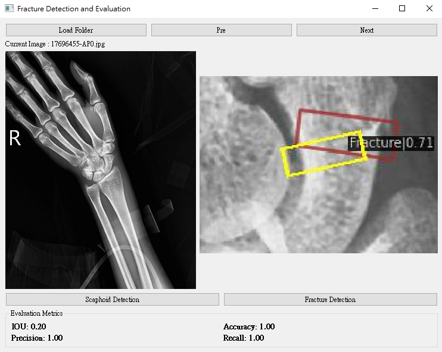

# Open-MMLab Homework

## 環境設置

### 1. 建立 Conda 虛擬環境

使用以下指令建立虛擬環境：

```bash
conda env create -f environment.yml
```

或手動執行以下指令：

```bash
conda create -n open-mmlab python=3.10 pytorch==1.10.1 cudatoolkit=10.2 torchvision -c pytorch -y
pip install mmcv-full==1.7.1 -f https://download.openmmlab.com/mmcv/dist/cu102/torch1.10/index.html
pip install yapf==0.31.0
```

### 2. 下載相關資料與程式

1. 切換到 `HW2/ip_homework_data` 資料夾：
   ```bash
   cd HW2/ip_homework_data
   ```

2. 使用 Git 下載 [mmrotate](https://github.com/open-mmlab/mmrotate)：
   ```bash
   git clone https://github.com/open-mmlab/mmrotate
   ```

## 資料與程式安置

### 步驟

1. 將以下檔案移動到指定位置：

   - `ip_homework_data/tool/ui_demo_two.py`
   - `ip_homework_data/tool/ui_demo.py`

   移動到 `mmrotate` 資料夾內。

2. 將以下檔案移動到 `mmrotate/configs/rotated_faster_rcnn` 資料夾內：

   - `my_rotated_faster_rcnn_fracture.py`
   - `my_rotated_faster_rcnn_scaphoid.py`

3. 將 `image_demo.py` 移動到 `mmrotate/demo` 資料夾內。

## 訓練模型

### 1. 舟狀骨偵測訓練

```bash
python tools/train.py configs/rotated_faster_rcnn/my_rotated_faster_rcnn_scaphoid.py
```

### 2. 骨折偵測訓練

```bash
python tools/train.py configs/rotated_faster_rcnn/my_rotated_faster_rcnn_fracture.py
```

> **注意**：由於認為相同一批資料的變化性不大，此處直接使用全量資料進行訓練，未拆分驗證集。

## 執行介面與偵測

### 1. 啟動 UI

切換到 `mmrotate` 資料夾，並執行以下指令：

```bash
python ui_demo_two.py
```

### 2. 使用 UI

- **Load Folder**：選擇 `demo` 資料夾，將需要偵測的檔案放置於該資料夾中。
- **Ground Truth**：將 Ground Truth 資料放置於 `ip_homework_data/fracture_detection/annotations`。




### 偵測功能

- **Scaphoid Detection**：偵測舟狀骨位置。
- **Fracture Detection**：偵測骨折位置。

### 偵測指標

- IOU
- Recall
- Precision
- Accuracy


